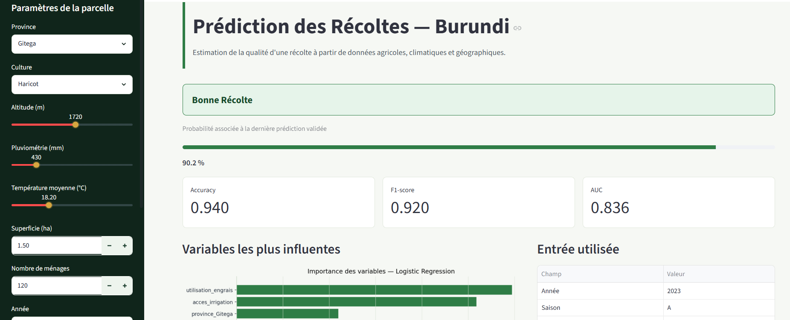

# Prédiction des Récoltes au Burundi

## Overview

Ce projet met en place un pipeline complet de Machine Learning pour prédire si une récolte agricole au Burundi sera bonne ou mauvaise à partir de données agronomiques, climatiques et géographiques. Le dataset utilisé contient des observations simulées couvrant 15 provinces du Burundi, 6 cultures principales, deux saisons agricoles et les années 2015 à 2023. Trois modèles sont entraînés et comparés : un arbre de décision, une forêt aléatoire et une régression logistique.

## Live Application

[Ouvrir l'application](https://agripredire-burundi.streamlit.app/)

L'application Streamlit permet de saisir les caractéristiques d'une parcelle agricole, de choisir un modèle et d'obtenir une prédiction avec la probabilité associée, les métriques du modèle et l'importance des variables.



## Project Structure

```text
agri-burundi-ml/
├── data/
│   └── agriculture_burundi.csv          Données agricoles utilisées pour l'étude.
├── src/
│   ├── __init__.py                      Initialisation du package Python.
│   ├── preprocess.py                    Fonctions de chargement, nettoyage, encodage, split et inférence.
│   ├── train.py                         Fonctions d'entraînement et de sauvegarde des modèles.
│   ├── evaluate.py                      Fonctions d'évaluation, visualisation et sauvegarde des métriques.
│   └── pipeline.py                      Script reproductible exécutant tout le pipeline ML.
├── models/
│   ├── decision_tree.pkl                Modèle arbre de décision entraîné.
│   ├── random_forest.pkl                Modèle forêt aléatoire entraîné.
│   ├── logistic_regression.pkl          Modèle régression logistique entraîné.
│   ├── scaler.pkl                       StandardScaler ajusté sur le jeu d'entraînement.
│   └── feature_columns.pkl              Liste des colonnes utilisées à l'entraînement.
├── notebooks/
│   └── TP_Agriculture.ipynb             Notebook complet répondant aux questions Q1 à Q28.
├── app/
│   └── streamlit_app.py                 Application web Streamlit déployable.
├── report/
│   └── rapport_Q29_Q30.md               Rapport final répondant à Q29 et Q30.
├── artifacts/
│   ├── X_train.csv                      Jeu d'entraînement sauvegardé pour reproductibilité.
│   ├── X_test.csv                       Jeu de test sauvegardé pour reproductibilité.
│   ├── y_train.csv                      Cible d'entraînement sauvegardée.
│   └── y_test.csv                       Cible de test sauvegardée.
├── metrics.json                         Résultats d'évaluation des trois modèles.
├── app_interface.png                    Capture d'écran de l'application avec une prédiction.
├── enonce_TP_agriculture_burundi.md     Énoncé du TP et contexte du problème à résoudre.
├── requirements.txt                     Dépendances Python du projet.
├── .gitignore                           Fichiers locaux exclus du suivi Git.
└── README.md                            Documentation du projet.
```

## Methodology

- **Dataset** : 1 620 observations initiales, couvrant 15 provinces, 6 cultures, 2 saisons agricoles et les années 2015 à 2023.
- **Prétraitement** : suppression des lignes sans cible, imputation des valeurs manquantes, encodage One-Hot des variables catégorielles, exclusion des variables causant du data leakage.
- **Modèles** : Decision Tree, Random Forest et Logistic Regression.
- **Évaluation** : Accuracy, F1-score pondéré, AUC et validation croisée à 5 folds.
- **Inférence** : l'application utilise les mêmes colonnes, le même scaler et la même fonction `build_inference_input()` que le notebook.

| Modèle | Accuracy | F1 | AUC | CV mean ± std |
|---|---:|---:|---:|---:|
| Decision Tree | 0.8987 | 0.9009 | 0.7520 | 0.9254 ± 0.0141 |
| Random Forest | 0.9304 | 0.8999 | 0.7419 | 0.9341 ± 0.0040 |
| Logistic Regression | 0.9399 | 0.9203 | 0.8358 | 0.9373 ± 0.0085 |

## Setup & Run Locally

```bash
conda activate agri-burundi
pip install -r requirements.txt
python src/pipeline.py
streamlit run app/streamlit_app.py
```

## Reproduce Full Pipeline

Pour régénérer les jeux train/test, les modèles, le scaler, les colonnes de features et `metrics.json` :

```bash
python src/pipeline.py
```

## Academic Context

Université Polytechnique de Gitega — BAC 4 Génie Logiciel  
TP Intelligence Artificielle Appliquée à l'Agriculture
